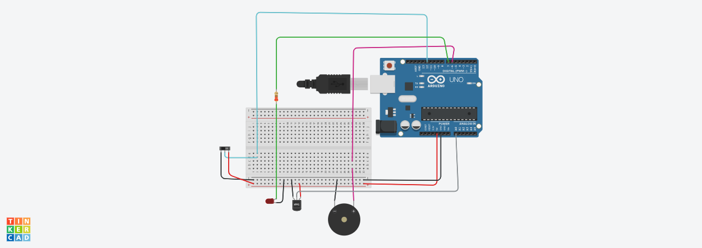

# Temperature-Based Gas Leak Detection System (Arduino + Tinkercad)

A simple yet effective embedded system designed to detect potential gas leaks by monitoring ambient temperature.  
Originally intended to use a **thermocouple sensor**, the project was adapted using a **TMP35 analog temperature sensor** due to Tinkercad's component limitations.

---

## Features
- Continuously monitors real-time temperature  
- Detects rapid temperature drops (e.g., due to gas expansion)  
- **Push button** used to simulate manual testing or reset  
- **Buzzer** activates upon detection of dangerous conditions  
- Fully simulated using **Tinkercad**

---

## Note on Hardware Limitation
> The thermocouple (e.g., MAX6675 + K-type) was initially planned for this project. However, since Tinkercad does not support thermocouples, the **TMP35 analog temperature sensor** was used as an alternative for simulation purposes.

---

## Components Used

| Component             | Quantity | Description                                       |
|----------------------|----------|---------------------------------------------------|
| Arduino Uno          | 1        | Microcontroller for core control                  |
| TMP35 Temperature Sensor | 1    | Analog sensor for detecting ambient temperature   |
| Buzzer               | 1        | Provides audible alert in case of gas detection   |
| Push Button          | 1        | Manual input for control or testing               |
| LED                  | 1        | Optional visual alert indicator                   |
| Resistor (220Ω)      | 2        | For button and LED                                |
| Breadboard           | 1        | Prototyping platform in Tinkercad                 |
| Jumper Wires         | Several  | For circuit connections                           |
| Power Supply (Simulated) | 1    | Provided via Tinkercad simulation                 |

---

## How It Works
- The **TMP35 sensor** reads ambient temperature.
- If the temperature drops below a defined threshold (e.g., < 18°C), the **buzzer** sounds.
- A **push button** may be used to reset the system or simulate user intervention.
- Designed to simulate real-world gas leakage where gas expansion leads to cooling.

---

## Circuit Demo

### Simulation Screenshot


---

## How to Use
1. Open the Tinkercad Simulation
2. Upload or paste the Arduino sketch  
3. Start the simulation  
4. Lower the TMP35 temperature input to observe buzzer activation  
5. Use the button to simulate control/reset (if implemented in code)

---

## Repository Structure
```
/temp-gas-detector/
├── temp_gas_detector.ino      # Arduino sketch
├── screenshots/               # Tinkercad circuit view
└── README.md
```

---

## Tools Used
- Tinkercad (circuit design and simulation)
- Arduino IDE
- TMP35 Analog Temperature Sensor


---

## Credits
Developed by Shravani Mundhe,  
First yaer, Electronics & Telecommunication Engineering, PCCoE

---

